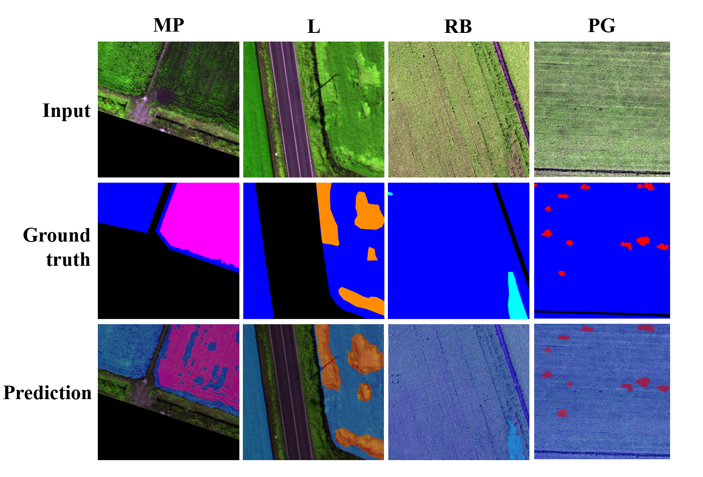
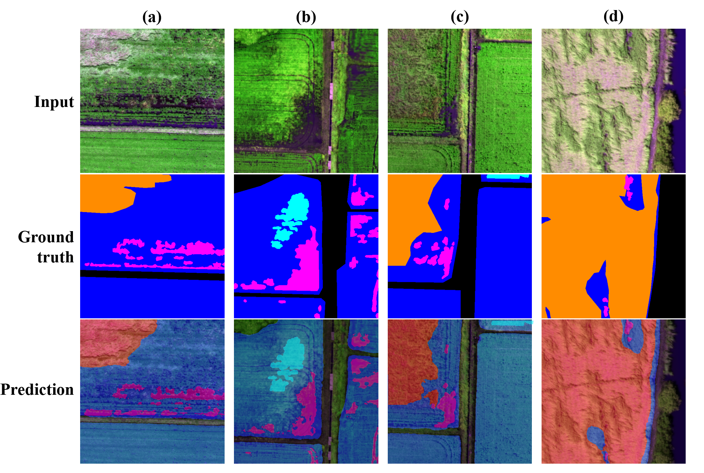

# Transformer-based Detection of Abnormal Rice Growth using Drone-based Multispectral Imaging

This repository contains the implementation of **ARG-TR**, a Transformer-based deep learning framework designed for the detection of abnormal rice growth using multispectral images captured by drones.  
The project leverages the MMSegmentation framework for semantic segmentation tasks and includes preprocessing scripts, trained models, and inference tools.

---

## 📌 Preparation (Pre-requisites)

### 1. Clone the repository
```bash
git clone https://github.com/minhdl93/ARG-TR-segmentation.git
cd ARG-TR-segmentation
```

### 2. Install MMSegmentation
```bash
cd mmsegmentation
pip install -v -e .
cd ..
```

### 3. Install required Python packages
Download and install the necessary packages from the provided `requirements.txt` file:
```bash
pip install -r requirements.txt
```

**Additional resources:**  
Some large dependencies (datasets, preprocessing scripts, or helper files) are provided via Google Drive:  
[Download additional resources](https://drive.google.com/drive/folders/1UYIIn68zHARaDQm5oz9Zx1FOZKYwaP18?usp=sharing)

### 4. Download pretrained checkpoint
Place the pretrained model in the `pretrained_ckpt` directory:
```plaintext
ARG-TR-segmentation/
    ├── pretrained_ckpt/
    │   └── best.pth
```

---

## 📂 Project directory structure
```plaintext
.
├── RiceSeg
│   ├── README.md
│   ├── src
│   ├── mmsegmentation
│   ├── sample_dataset
│   ├── pretrained_ckpt
│   ├── requirements.txt
│   └── .gitignore
└── index.html
```

---

## 🚀 Inference

### Run inference and evaluate mIoU:
```bash
python3 ./mmsegmentation/tools/test.py {config_file_path} {checkpoint_path} --eval mIoU --show-dir {output_path}
```

**Example using the provided best checkpoint:**
```bash
python3 mmsegmentation/tools/test.py \
    mmsegmentation/configs/rice/segformer_mit-b4_lovasz_gne_chw.py \
    ./pretrained_ckpt/best.pth \
    --eval mIoU
```

The results will be saved in the directory specified by `--show-dir` (optional).

## Sample Segmentation Results

### Figure 1: Predictions of the ARG-TR framework for all abnormal rice growth classes
  
*Note: MP: Missing Plants (Magenta), PG: Poor Growth (Red), RBD: Rice Blast Disease (Cyan), L: Lodging (Orange), Blue indicates healthy rice, and Black represents bare ground.*

---

### Figure 2: ARG-TR predictions for challenging mixed-condition cases
  
*Note: MP: Missing Plants (Magenta), RBD: Rice Blast Disease (Cyan), L: Lodging (Orange), Blue indicates healthy rice, and Black represents bare ground.*


---

## 📧 Contact
For questions or issues, please open an [issue](https://github.com/minhdl93/ARG-TR-segmentation/issues) or contact the maintainer.

---

